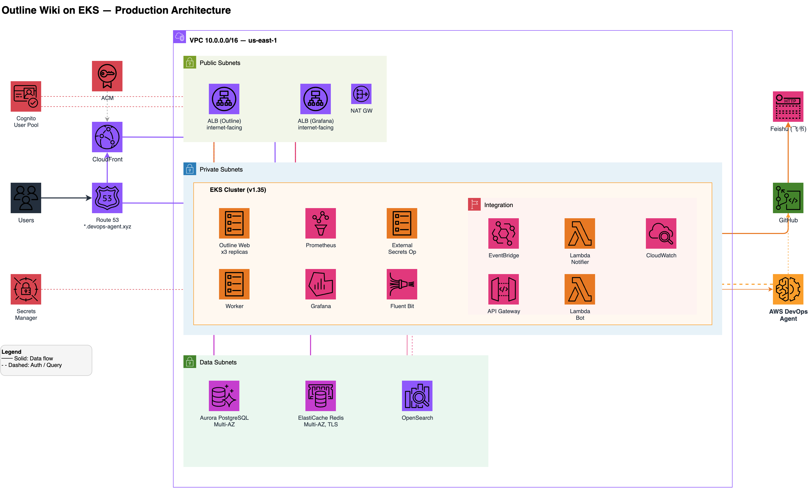

# AWS DevOps Agent 演示平台

## 平台目的

这个演示平台的目标是为 GCR 的一线团队和客户提供一个**可交互的、真实的生产级环境**，用于体验和展示 AWS DevOps Agent 的核心能力：

1. **自动化事件调查**：当应用出现故障时，DevOps Agent 自动关联多个数据源（Prometheus 指标、OpenSearch 日志、CloudWatch 资源指标、GitHub 代码变更），快速定位根因
2. **对话式 SRE 交互**：通过自然语言查询基础设施状态，无需在 CloudWatch、Grafana、kubectl 之间切换
3. **预防性建议**：基于历史事件数据生成针对性的改进建议，从被动救火转向主动预防

平台面向以下使用场景：
- **客户演示**：向 Pilot 客户展示 DevOps Agent 如何在真实 workload 上工作
- **内部培训**：帮助 TAM/SA 理解 DevOps Agent 的能力边界和最佳实践
- **故障注入演练**：通过预设的故障场景，端到端验证 告警 → 通知 → 工单 → 自动调查 的完整链路

## 架构概览



### 为什么选择 Outline

[Outline](https://github.com/getoutline/outline) 是一个开源的团队知识库应用，我们选择它作为演示 workload 是因为它具备典型生产应用的所有特征：

- **多层架构**：Web 前端 + API 后端 + 后台 Worker + WebSocket 实时协作
- **多数据存储**：PostgreSQL（持久化）+ Redis（缓存/消息队列/WebSocket pub/sub）+ 全文搜索
- **有状态服务**：文档协作编辑依赖 WebSocket 长连接和 Redis pub/sub
- **后台任务**：文档导出、邮件通知、搜索索引等异步任务通过 Bull 队列处理
- **真实的故障模式**：数据库连接池耗尽、缓存级联故障、部署回归、代码 Bug 等场景都能自然发生

这些特征使得 DevOps Agent 在调查时需要跨多个数据源关联信息，充分展示其能力。

### 基础设施组件

| 层级 | 组件 | 说明 |
|------|------|------|
| **流量入口** | Route 53 + CloudFront + ALB | `outline.devops-agent.xyz` 经 CDN 加速；`grafana.devops-agent.xyz` 直连 ALB |
| **认证** | Cognito User Pool + Amazon Federate | 内部员工通过 Midway 登录，无需单独创建账号 |
| **计算** | EKS v1.35（3 节点 m5.xlarge） | Outline Web × 3 副本 + Worker × 1 + Grafana + Prometheus + Fluent Bit |
| **数据库** | Aurora PostgreSQL Multi-AZ | 文档、用户、团队等核心数据 |
| **缓存** | ElastiCache Redis Multi-AZ, TLS | 会话缓存、Bull 任务队列、WebSocket pub/sub |
| **搜索** | OpenSearch 2 节点 | 应用日志（Fluent Bit 采集）+ Outline 事件日志 |
| **可观测性** | Prometheus + Grafana | 应用指标（StatsD → statsd-exporter）+ K8s 指标 + AWS 资源指标 |
| **密钥管理** | Secrets Manager + External Secrets Operator | 所有密钥通过 ESO 同步到 K8s，仓库中无明文 |

### DevOps Agent 集成

DevOps Agent 通过以下能力接入演示环境：

| 能力 | 接入方式 | 用途 |
|------|---------|------|
| **CloudWatch** | 自动检测 | 查询 AWS 资源指标（RDS 连接数、ElastiCache 内存、EKS 节点状态等） |
| **Grafana** | VPC Lattice 私有连接 | 查询 Prometheus 指标和 OpenSearch 日志，流量不经公网 |
| **GitHub** | OAuth + 仓库关联 | 追溯代码变更、部署历史、关联 commit 与故障时间线 |

### 告警 → 调查链路

```
应用故障
  → Prometheus 检测异常指标
  → PrometheusRule 触发告警（7 条规则覆盖 OOM/CrashLoop/高延迟/高错误率等）
  → Alertmanager → SNS → Lambda (feishu_notifier)
    ├── 飞书群：告警卡片（含严重级别、摘要、Grafana Dashboard 链接）
    └── GitHub Issue：在 devops-agent-demo-tickets 仓库自动创建工单
          └── GitHub Actions 监听 issues.opened
                → HMAC Webhook 触发 DevOps Agent 创建调查
                → EventBridge 将调查状态变更回写到 GitHub Issue 评论
```

## 如何登录

| 系统 | URL | 登录方式 |
|------|-----|---------|
| **Outline** | https://outline.devops-agent.xyz | 点击 "AmazonFederate" 按钮，使用内部 Midway 账号登录 |
| **Grafana** | https://grafana.devops-agent.xyz | 点击 "Sign in with Amazon Cognito"，使用内部 Midway 账号登录 |
| **DevOps Agent Web App** | AWS Console → DevOps Agent → `outline` space → Open web app | Admin access（IAM 认证），TAM 和 SA 默认有权限 |

> **飞书 Bot**：目前正在和 CN Tech team 沟通接入。接入后可在飞书群中 @Bot 直接与 DevOps Agent 对话，无需打开 AWS Console。

## 演示场景

目前支持 **6 个场景**，形成递进式故事线：对话了解环境 → 自动调查救火 → 主动预防。

| # | 场景 | 方式 | 时长 | 核心能力 |
|---|------|------|------|----------|
| 1 | **Chat 对话式交互** | 现场 | 5 min | 自然语言查询基础设施状态，展示 Agent 对环境的理解 |
| 2 | **DB 连接池耗尽** | 预录 | 8 min | 自动调查 + 关联 Prometheus 指标、OpenSearch 日志、CloudWatch RDS 指标 |
| 3 | **Redis 级联故障** | 现场注入 | 8 min | 多告警同时触发时的拓扑感知 + 告警去重，识别真正根因 |
| 4 | **坏部署延迟飙升** | 预录 | 5 min | 关联 GitHub 部署记录 + commit 变更，确认故障与部署时间吻合 |
| 5 | **代码 Bug 导致 Worker OOM** | 现场 | 8 min | 一次点击触发：导出集合 → 内存泄漏 → OOM → 告警 → 工单 → Agent 追溯到代码行 |
| 6 | **预防建议（Ops Backlog）** | 现场 | 5 min | 基于历史调查生成改进建议，Agent-ready Spec 可交给编码 Agent 实施 |

总时长约 **40 分钟**，可根据客户兴趣选择性演示。

### 场景 5 详细说明

这是最能体现 DevOps Agent 端到端能力的场景：

1. **触发**：在 Outline 中点击 Collection → "⋯" → "Export"（需要 collection 中有一篇空标题文档）
2. **故障**：Worker 处理导出时遇到空标题文档，代码中的内存泄漏 Bug 被触发，每次重试泄漏 ~100MB，最终 OOM Kill
3. **告警**：`OutlinePodCrashLooping` 告警触发 → 飞书群收到告警卡片 → GitHub 自动创建工单
4. **调查**：DevOps Agent 自动启动调查，关联 Grafana 内存指标、OpenSearch 错误日志、GitHub 代码变更
5. **根因**：Agent 定位到 `ExportDocumentTreeTask.ts` 中的 `_exportDeduplicationBuffer` 模块级数组无限增长 + 重试次数被错误地从 1 改为 50

### 故障注入命令

```bash
./scripts/chaos.sh db-exhaust       # 场景 2：DB 连接池耗尽
./scripts/chaos.sh redis-failure    # 场景 3：Redis 级联故障
./scripts/chaos.sh slow-deploy      # 场景 4：坏部署延迟飙升
./scripts/chaos.sh export-oom       # 场景 5：导出 OOM（需要 OUTLINE_TOKEN）

# 清理
./scripts/chaos.sh <scenario> --cleanup
```

## 代码仓库

| 仓库 | 用途 |
|------|------|
| [JoeShi/devops-agent-demo](https://github.com/JoeShi/devops-agent-demo) | 基础设施代码（Terraform、K8s 清单、Grafana 配置、故障注入脚本） |
| [JoeShi/outline](https://github.com/JoeShi/outline) | Outline 应用源代码（含演示用 Bug） |
| [JoeShi/devops-agent-demo-tickets](https://github.com/JoeShi/devops-agent-demo-tickets) | 事件工单（由 Lambda 根据告警自动创建，GitHub Actions 触发 Agent 调查） |
